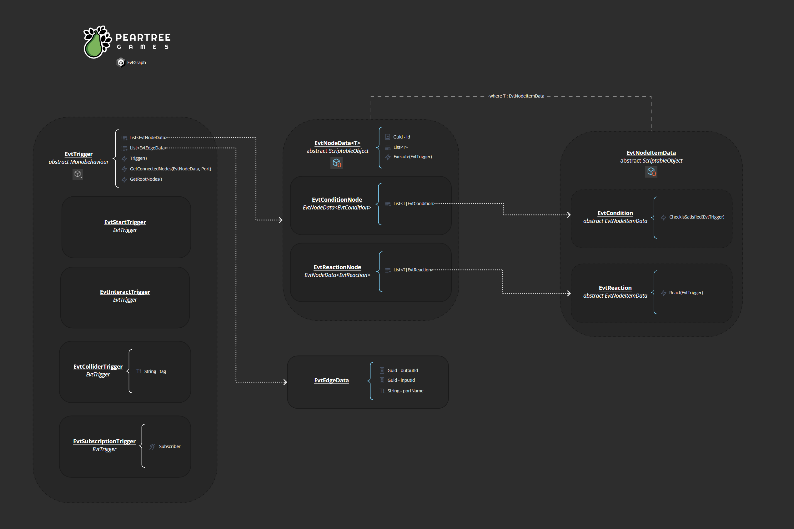

## EvtGraph
Code for "Creating a Serialized Conditional Reaction Sequence Graph in Unity" [YouTube videos](https://www.youtube.com/watch?v=KJ_ba50nooQ)

Repository has been converted to a package module. The `video-end` branch contains the project at the time of the part 2 completion.

A few UIElements used were introduced in Unity 2021, for previous version of Unity the code will need to be modified to work. A PR with version compile directives would be welcome, but I don't think I'll ever get around to it.

## Installation
Can be installed via the Package Manager > Add Package From Git URL...

This repo has a dependency on the EvtVariable package which *MUST* be installed first. (From my understanding Unity does not allow git urls to be used as dependencies of packages)
`https://github.com/peartreegames/evt-variables.git`

then the repo can be added

`https://github.com/peartreegames/evt-graph.git`

## Architectural Overview

## Changes
 
  - Templates: Save As and Load EvtGraph structures as template assets
  - Lock: Lock EvtGraphView on selected EvtTrigger
  
## Todos
 - [ ] Zoom Persistence (Seems to be more complicated than originally thought)
 - [X] Foldout Persistence
 - [X] Rest of EvtTriggers
 - [ ] Standard set of Condition/Reactions
 - [ ] Allow template graph editing directly in GraphView
